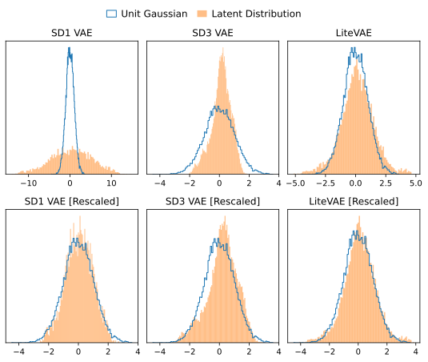

## open-LiteVAE

---
[](https://arxiv.org/abs/2405.14477) [](https://huggingface.co/collections/RGenDiff/open-litevae-67a83645560939c755d099f7)
 
Implementation of **"[LiteVAE: Lightweight and Efficient Variational Autoencoders for Latent Diffusion Models](https://openreview.net/forum?id=mTAbl8kUzq)"** [2024]. The paper introduces an efficient wavelet-encoder-based variational autoencoder, which demonstrates a significant performance improvement and stable training compared with previous works. This implementation aims to replicate and extend its findings using GPU-accelerated wavelet transformations (**[torch-dwt](https://github.com/KeKsBoTer/torch-dwt)**), stochastic image rescaling, and improved discriminator models.

#### Note
This implementation was independently developed **before the authors provided pseudocode** in the appendix of their paper. As a result, the approach here may differ slightly in details but adheres to the paper's methodology and goals.


## Please Cite the Original Paper

```
@inproceedings{
sadat2024litevae,
title={Lite{VAE}: Lightweight and Efficient Variational Autoencoders for Latent Diffusion Models},
author={Seyedmorteza Sadat and Jakob Buhmann and Derek Bradley and Otmar Hilliges and Romann M. Weber},
booktitle={The Thirty-eighth Annual Conference on Neural Information Processing Systems},
year={2024},
url={https://openreview.net/forum?id=mTAbl8kUzq}
}
```

---
## Model Configurations 


### Encoder

Comparison of encoder model configurations for n<sub>z</sub>=12, following the structure proposed by LiteVAE. FLOPs are reported for a resolution of 256x256. For comparison, the SD-VAE encoder is 34.16 M parameters and uses 137 GFLOPs at 256x156. LiteVAE showed equivelent performance with the B-scale encoder when matching n<sub>z</sub>.

<table>
  <thead>
    <tr>
      <th rowspan="2">Scale</th>
      <th rowspan="1" colspan="2">Parameter Count</th>
      <th rowspan="1">FLOPs</th>
      <th colspan="3">Extractor</th>
      <th colspan="3">Aggregator</th>
    </tr>
    <tr>
    <th>LiteVAE</th>
     <th> Ours </th>
     <th> Ours </th>
      <th>C</th>
      <th>Mult</th>
      <th>Blocks</th>
      <th>C</th>
      <th>Mult</th>
      <th>Blocks</th>
    </tr>
  </thead>
  <tbody align="center">
    <tr>
      <td>S</td>
      <td align="right">1.03 M</td>
      <td align="right">0.97 M</td>
      <td align="right"> 5.5 G </td>
      <td>16</td>
      <td>[1,2,2]</td>
      <td>3</td>
      <td>16</td>
      <td>[1,2,2]</td>
      <td>3</td>
    </tr>
    <tr>
      <td>B</td>
      <td align="right">6.75 M</td>
      <td align="right">6.60 M</td>
      <td align="right"> 37.4 G </td>
      <td>32</td>
      <td>[1,2,3]</td>
      <td>4</td>
      <td>32</td>
      <td>[1,2,3]</td>
      <td>4</td>
    </tr>
        <tr>
      <td>M</td>
      <td align="right">32.75 M</td>
      <td align="right">34.00 M </td>
      <td align="right"> 234.9 G </td>
      <td>64</td>
      <td>[1,2,4]</td>
      <td>5</td>
      <td>32</td>
      <td>[1,2,3]</td>
      <td>4</td>
    </tr>
      <tr>
      <td>L</td>
      <td align="right">41.42 M</td>
      <td align="right">41.15 M</td>
      <td align="right"> 242.1 G</td>
      <td>64</td>
      <td>[1,2,4]</td>
      <td>5</td>
      <td>64</td>
      <td>[1,2,4]</td>
      <td>4</td>
    </tr>
  </tbody>
</table>


### Decoder

We follow LiteVAE basing our decoder on the SD VAE, replacing Conv-Norm pairs with SMC layers. Skip connections retain the original Conv2d as they are used to adapt feature dimensions. We also remove the single-headed attention layer from the VAE in place of an additional ResNet block since this layer has little effect and limits the decoder resolution. FLOPs are reported for a resolution of 256x256.

<table>
<thead>
	 <tr>
     <th> Model </th>
     <th> Params </th>
     <th> FLOPs </th>
     <th> C </th>
     <th> Mult </th>
     <th> Blocks </th>
     <th> Attn </th>
     </tr>
</thead>
<tbody align="center">
	<tr>
    <td> SDVAE </td>
    <td align="right"> 49.49 M </td>
    <td align="right"> 312 G </td>
    <td> 128 </td>
    <td> [1,2,4,4] + 4 </td>
    <td> [3,3,3,3] + 2 </td>
    <td> [ ] + 1 </td>
    </tr>
	<tr>
    <td> Ours </td>
    <td align="right"> 53.33 M </td>
    <td align="right"> 324 G </td>
    <td> 128 </td>
    <td> [1,2,4,4] + 4 </td>
    <td> [3,3,3,3] + 3 </td>
    <td> None </td>
    </tr>
</tbody>
</table>

### Discriminator

Comparison of Discriminators, scaled to roughly match FLOPs between variants. Notably the GigaGAN discriminator contains more parameters due to the multiple predictor levels and soft filter-bank convolution layers. FLOPs are reported for a resolution of 256x256.

<table>
<thead>
	 <tr>
     <th> Model </th>
     <th> Params </th>
     <th> FLOPs </th>
     <th> Config (256x256) </th>
     </tr>
</thead>
<tbody align="center">
	<tr>
    <td> PatchGAN </td>
    <td align="right"> 2.77M </td>
    <td align="right"> 3.15G </td>
    <td> n<sub>layers</sub>=3, n<sub>df</sub>=64 </td>
    </tr>
	<tr>
    <td> GigaGAN </td>
    <td align="right"> 14.38M </td>
    <td align="right"> 3.23G </td>
    <td> C<sub>base</sub>=4096, C<sub>max</sub>=256, n<sub>blocks</sub>=2, attn=[8,16] </td>
    </tr>
	<tr>
    <td> UNetGAN-S </td>
    <td align="right"> 2.75M  </td>
    <td align="right"> 2.31G </td>
    <td> D<sub>ch</sub>=16, attn=None </td>
    </tr>
	<tr>
    <td> UNetGAN-M </td>
    <td align="right"> 11.0M </td>
    <td align="right"> 9.13G </td>
    <td> D<sub>ch</sub>=32, attn=None </td>
    </tr>
	<tr>
    <td> UNetGAN-L </td>
    <td align="right"> 44.1M  </td>
    <td align="right"> 36.34G </td>
    <td> D<sub>ch</sub>=64, attn=None </td>
    </tr>
</tbody>
</table>


---

## Comparisons

#### Evaluation Metrics

Evaluation metrics were computed on the ImageNet training set with the B-Scale encoder using n<sub>z</sub>=12. Training is conducted in two phases: A) pre-training at 128x128 with no discriminator for 100k steps, B) finetuning at 256x256 with discriminator for 50k steps. 

All metrics are computed on the full ImageNet-1k validation set (50k images) using bi-cubic rescaling and center cropping. Comparing reported VAE (retrained SDVAE) and LiteVAE to configurations in this repo. Also showing the SD1-MSE VAE (n<sub>z</sub>=4) and SD3-VAE (n<sub>z</sub>=16). Notably, results seem to be highly dependent on loss weights (including discriminator), trading rFID for LPIPS, PSNR, and SSIM.

<table>
  <thead>
    <tr>
      <th rowspan="2">Method</th>
      <th rowspan="2"> Disc Type </th>
      <th colspan="3">Loss Weights</th>
      <th colspan="4">Evaluation 256x256</th>
    </tr>
    <tr>
      <th>w<sub>kl</sub></th>
      <th>w<sub>wave</sub></th>
      <th>w<sub>gauss</sub></th>
      <th>LPIPS</th>
      <th>PSNR</th>
      <th>rFID</th>
      <th>SSIM</th>
    </tr>
  </thead>
  <tbody align="center">
    <tr>
      <td>SD1-VAE</td>
      <td>PatchGAN</td>
      <!-- Weights -->
      <td>?</td>
      <td>N/A</td>
      <td>N/A</td>
      <!-- 256x256 -->
      <td>0.138</td>
      <td>25.70</td>
      <td>0.75</td>
      <td>0.72</td>
    </tr>
    <tr>
      <td>SD3-VAE</td>
      <td>PatchGAN?</td>
      <!-- Weights -->
      <td>?</td>
      <td>N/A</td>
      <td>N/A</td>
      <!-- 256x256 -->
      <td><b>0.069</b></td>
      <td>29.59</td>
      <td><b>0.22</b></td>
      <td>0.86</td>
    </tr>
    <tr>
      <td>VAE</td>
      <td>PatchGAN</td>
      <!-- Weights -->
      <td>?</td>
      <td>N/A</td>
      <td>N/A</td>
      <!-- 256x256 -->
      <td><b>0.069</b></td>
      <td>29.25</td>
      <td>0.95</td>
      <td>0.86</td>
    </tr>
     <tr>
      <td>LiteVAE</td>
      <td>UNetGAN-?</td>
      <!-- Weights -->
      <td>?</td>
      <td>?</td>
      <td>?</td>
      <!-- 256x256 -->
      <td><b>0.069</b></td>
      <td>29.55</td>
      <td>0.94</td>
      <td><b>0.87</b></td>
    </tr>
    <tr>
      <td>A1 (Ours)</td>
      <td>N/A</td>
      <!-- Weights -->
      <td>0.01</td>
      <td>0.1</td>
      <td>0.1</td>
      <!-- 256x256 -->
      <td>0.081</td>
      <td>29.38</td>
      <td>1.86</td>
      <td>0.85</td>
    </tr>
    <tr>
      <td>A2 (Ours)</td>
      <td>N/A</td>
      <!-- Weights -->
      <td>0.01</td>
      <td>1.0</td>
      <td>0.5</td>
      <!-- 256x256 -->
      <td>0.084</td>
      <td>29.78</td>
      <td>1.12</td>
      <td>0.86</td>
    </tr>
    <tr>
      <td>B0 (Ours)</td>
      <td> None </td>
      <!-- Weights -->
      <td>0.01</td>
      <td>1.0</td>
      <td>0.5</td>
      <!-- 256x256 -->
      <td>0.076</td>
      <td><b>30.03</b></td>
      <td>1.29</td>
      <td>0.86</td>
    </tr>
    <tr>
      <td>B1 (Ours)</td>
      <td> PatchGAN </td>
      <!-- Weights -->
      <td>0.01</td>
      <td>1.0</td>
      <td>0.5</td>
      <!-- 256x256 -->
      <td>0.080</td>
      <td>29.12</td>
      <td>0.30</td>
      <td>0.84</td>
    </tr>
    <tr>
      <td>B2 (Ours)</td>
      <td> GigaGAN </td>
      <!-- Weights -->
      <td>0.01</td>
      <td>1.0</td>
      <td>0.5</td>
      <!-- 256x256 -->
      <td>0.080</td>
      <td>29.27</td>
      <td>0.31</td>
      <td>0.85</td>
    </tr>
    <tr>
    <td>B3 (Ours)</td>
      <td> UNetGAN-S </td>
      <!-- Weights -->
      <td>0.01</td>
      <td>1.0</td>
      <td>0.5</td>
      <!-- 256x256 -->
      <td>0.080</td>
      <td>29.15</td>
      <td>0.38</td>
      <td>0.85</td>
    </tr>
    <tr>
    <td>B4 (Ours)</td>
      <td> UNetGAN-M </td>
      <!-- Weights -->
      <td>0.01</td>
      <td>1.0</td>
      <td>0.5</td>
      <!-- 256x256 -->
      <td>0.080</td>
      <td>29.07</td>
      <td>0.30</td>
      <td>0.84</td>
    </tr>
    <td> <a href="https://huggingface.co/RGenDiff/olitevaeB_im_f8c12">B5 (Ours)</a> </td>
      <td> UNetGAN-L </td>
      <!-- Weights -->
      <td>0.01</td>
      <td>1.0</td>
      <td>0.5</td>
      <!-- 256x256 -->
      <td>0.084</td>
      <td>28.74</td>
      <td>0.24</td>
      <td>0.84</td>
    </tr>
  </tbody>
</table>


#### Latent Distributions



#### Comparison Findings

- We achieve similar results to the original LiteVAE paper, which are in turn competitive with the SD3-VAE, with differences that can be attributed to the value of n<sub>z</sub>.
- The differing LPIPS and rFID scores from LiteVAE may be attributed to the KL loss weight (w<sub>kl</sub>), where a higher value will result in worse reconstruction but stronger adherence to the latent space unit Gaussian objective.
- rFID and the other metrics (LPIPS, SSIM, and PSNR) are inversely related, where a better rFID will degrade the other metrics. However, while FID itself has many issues, it appears to be a stronger indicator of image quality compare with the other metrics.
- Overall, the discriminator type has a minor impact, with the original PatchGAN discriminator performing well. UNetGAN may perform better when considering a larger version, but this becomes difficult to justify given the increased training FLOPs. 


---

## Repository Structure

```
configs/         
    - Configuration files for setting up the experiments and models.

olvae/
    - Main directory for the Open LiteVAE project.
    ├── data/        
    │   - Contains the dataloader for data preparation and augmentation. 
    ├── models/      
    │   - Contains PyTorch Lightning models for training and evaluation. 
    ├── modules/     
        - Contains model-specific layers and architectures.
        ├── litevae/
        │   - Specialized layers for the LiteVAE model. 
        ├── basicgan/
        │   - Common GAN components and loss functions [include PatchGAN discriminator]. 
        ├── gigagan/
        │   - Layers specific to the GigaGAN discriminator. 
        ├── unetgan/
        │   - Layers and components for the UnetGAN discriminator. 

scripts/
    - Code for evaluation, testing, and utilities.
```

---

## Setup

#### Dependencies
- Python >= 3.9
- PyTorch >= 2.0
- Torch-DWT

#### Installation

Install via requirements.txt

```
pip install -r requirements.txt
pip install -e .
```

#### Model Checkpoints

Coming Soon.

---

## Evaluation

Run the `compute_metrics.py` script to compute the evaluation metrics. Will compute LPIPS, PSNR, rFID, and SSIM using the test loader specified in the configuration file. 

Expects the parent directory structure to be in the form `<parent>/checkpoints/last.ckpt` and will search for the `<config.yaml>` in the `<config directory>` which follows from `<parent> = <timestamp>_<config>_<precision>`. This search will still work if the timestamp and precision are not included as `<config>` is extracted by splitting on `_` and removing the first and last element in the list. 

```bash
python script/compute_metrics.py --config_base <config directory> -B <batch_size> <run parent directory>
```

Alternatively, you can specify the configuration and checkpoint directly.

```bash
python script/compute_metrics.py --config <config.yaml> -B <batch_size> <checkpoint.ckpt>
```

---

## Training

The example code uses OmegaConfig yaml files to specify and dynamically construct the models. By default, we utilize the WebDataset format to efficiently stream large collections of data from disk, with an interface constructor for `train_loader()`, `val_loader()`, and `test_loader()`. Notably, this pattern can wrap other dataloader types such as the typical ImageDataset or a default torchvision dataset. 

Training utilizes Pytorch Lightning to handle multi-GPU communication, mixed-precision training, and gradient accumulation. As such, training becomes relatively simple. The current codebase supports training in full FP32 (32), half precision (16), and bfloat (bf16).

```
python train.py --base <config.yaml> \
                --logdir <log directory> \
                --precision <training precision> \
                --gpus <gpu count or list> \
                --seed <random seed> \
                --name <config_name> 
```

This codebase also supports resuming from a stopped run. **Note:** we recommend changing the random seed when resuming.

```
python train.py --base <config.yaml> \
                --logdir <log directory> \
                --precision <training precision> \
                --gpus <gpu count or list> \
                --seed <random seed> \
                --resume <previous run directory>
```

For transitioning between PhaseA and PhaseB training, we recommend using `--actual_resume` which will reset the optimizer states. This trick is adapted from **[Textual-Inversion](https://github.com/rinongal/textual_inversion)**.

```
python train.py --base <config.yaml> \
                --logdir <log directory> \
                --precision <training precision> \
                --gpus <gpu count or list> \
                --seed <random seed> \
                --actual_resume <previous.ckpt> \
                --name <config_name> 
```

---

## TODO

- [ ] Add Description of Improved Methods
- [ ] Add Training Code
- [ ] Add Evaluation Code
- [ ] More Experiments

---


## References

#### LiteVAE

```
@inproceedings{
sadat2024litevae,
title={Lite{VAE}: Lightweight and Efficient Variational Autoencoders for Latent Diffusion Models},
author={Seyedmorteza Sadat and Jakob Buhmann and Derek Bradley and Otmar Hilliges and Romann M. Weber},
booktitle={The Thirty-eighth Annual Conference on Neural Information Processing Systems},
year={2024},
url={https://openreview.net/forum?id=mTAbl8kUzq}
}
```

#### SD-VAE

```
@article{Rombach2021HighResolutionIS,
  title={High-Resolution Image Synthesis with Latent Diffusion Models},
  author={Robin Rombach and A. Blattmann and Dominik Lorenz and Patrick Esser and Bj{\"o}rn Ommer},
  journal={2022 IEEE/CVF Conference on Computer Vision and Pattern Recognition (CVPR)},
  year={2021},
  pages={10674-10685},
}
```

#### PatchGAN

```
@article{Isola2016ImagetoImageTW,
  title={Image-to-Image Translation with Conditional Adversarial Networks},
  author={Phillip Isola and Jun-Yan Zhu and Tinghui Zhou and Alexei A. Efros},
  journal={2017 IEEE Conference on Computer Vision and Pattern Recognition (CVPR)},
  year={2016},
  pages={5967-5976},
}
```

#### GigaGAN

```
@article{Kang2023ScalingUG,
  title={Scaling up GANs for Text-to-Image Synthesis},
  author={Minguk Kang and Jun-Yan Zhu and Richard Zhang and Jaesik Park and Eli Shechtman and Sylvain Paris and Taesung Park},
  journal={2023 IEEE/CVF Conference on Computer Vision and Pattern Recognition (CVPR)},
  year={2023},
  pages={10124-10134},
}
```

#### U-NetGAN

```
@article{Schnfeld2020AUB,
  title={A U-Net Based Discriminator for Generative Adversarial Networks},
  author={Edgar Sch{\"o}nfeld and Bernt Schiele and Anna Khoreva},
  journal={2020 IEEE/CVF Conference on Computer Vision and Pattern Recognition (CVPR)},
  year={2020},
  pages={8204-8213},
}
```

